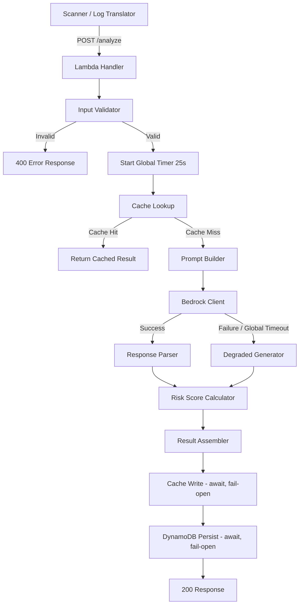
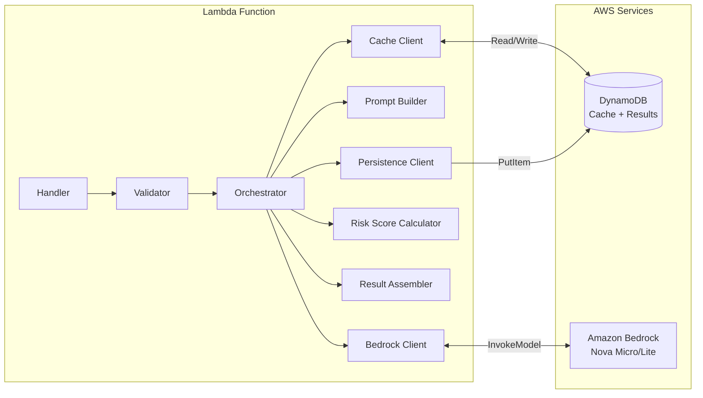
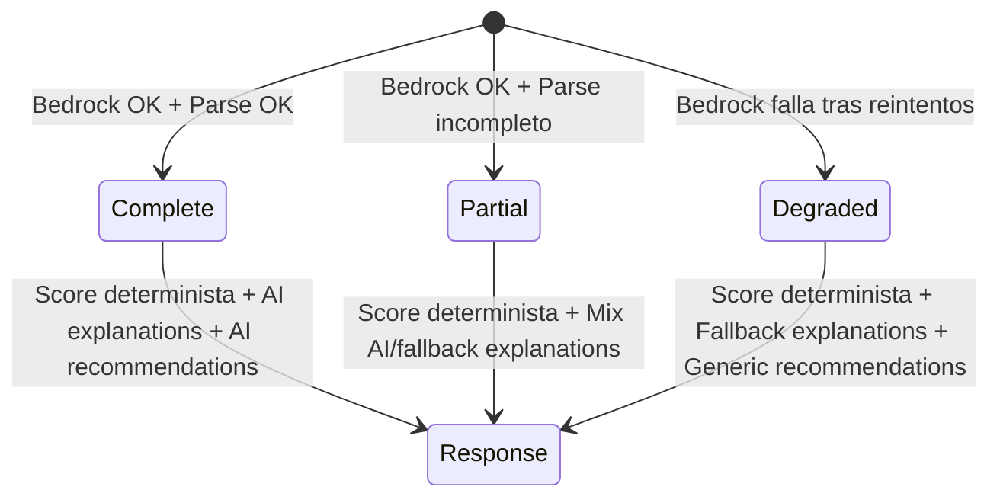

# Design Document — AI Engine (CentinelaIA)

## Overview

El módulo AI Engine es el componente central de inteligencia artificial de CentinelaIA. Actúa como servicio compartido que transforma hallazgos técnicos de seguridad (Finding[]) en análisis comprensibles para usuarios no expertos: explicaciones en lenguaje natural, un score de riesgo compuesto determinista (0-100), y recomendaciones priorizadas de remediación.

### Decisiones clave de diseño

1. **Módulo compartido, no duplicado**: El AI Engine expone una interfaz agnóstica al origen — tanto el scanner como el futuro traductor de logs lo invocan con el mismo contrato (Finding[]).
2. **Score determinista, explicaciones por IA**: El Risk_Score se calcula con fórmula fija (sin influencia de Bedrock) para garantizar reproducibilidad y resistencia a prompt injection. Las explicaciones y recomendaciones se enriquecen con IA pero tienen fallbacks deterministas.
3. **Degradación graceful**: Si Bedrock falla, el módulo retorna resultados útiles basados en la fórmula de score y templates genéricos — nunca deja al usuario sin respuesta.
4. **Caché para economía**: Resultados cacheados en DynamoDB con TTL evitan llamadas redundantes a Bedrock, optimizando costos dentro del free tier.
5. **Prompt engineering encapsulado**: Los prompts viven separados de la lógica de orquestación, permitiendo iteración rápida sobre calidad de respuestas.

### Flujo de datos de alto nivel



## Architecture

### Arquitectura de componentes



### Principios arquitectónicos

- **Separación handler/servicio**: El handler Lambda solo parsea el evento HTTP y delega al servicio. La lógica de negocio es testeable sin infraestructura.
- **Dependency Injection**: El Bedrock Client y el Cache Client se inyectan como dependencias, permitiendo mocks en tests.
- **Single Responsibility**: Cada componente tiene una sola razón para cambiar — el prompt builder no sabe de DynamoDB, el score calculator no sabe de Bedrock.
- **Fail-open para caché**: Errores de caché nunca bloquean el flujo principal. La escritura se espera (await) con timeout corto — no se dispara sin esperar, para evitar que Lambda congele el entorno antes de completar.

## Components and Interfaces

### 1. Handler (`handlers/analyze-handler.ts`)

Punto de entrada Lambda. Parsea el evento de API Gateway, invoca al orchestrator del AI Engine, y formatea la respuesta HTTP.

```typescript
// Responsabilidades:
// - Parsear body JSON del evento API Gateway
// - Rutear GET /analyze/{id} vs GET /analyze?sessionId= vs POST /analyze
// - Llamar al servicio correspondiente
// - Formatear respuesta HTTP (status code, headers, body)
```

### 2. Validator (`services/ai-engine/validator.ts`)

Valida la estructura de entrada antes de procesarla.

```typescript
interface ValidationResult {
  valid: boolean;
  error?: { message: string; index?: number };
  sanitizedInput?: AnalysisRequest;
}

// Responsabilidades:
// - Verificar campos obligatorios (findings, sessionId)
// - Validar cada Finding (category, severity, description length)
// - Sanitizar rawValue/description (remover chars de control)
// - Truncar a 50 findings por severidad si excede límite
```

### 3. Risk Score Calculator (`services/ai-engine/risk-score.ts`)

Calcula el score determinista sin dependencia externa.

```typescript
// Pesos de severidad
const SEVERITY_WEIGHTS: Record<FindingSeverity, number> = {
  critical: 25,
  high: 15,
  medium: 8,
  low: 3,
  info: 0,
};

// Responsabilidades:
// - Calcular score base: sum(peso × cantidad por severidad), cap 100
// - Calcular factor de diversidad: +10% por categoría con findings medium+
// - Aplicar tope final en 100
// - Determinar riskLevel string basado en rangos
// - Garantizar determinismo (independiente del orden de entrada)
```

### 4. Prompt Builder (`services/ai-engine/prompts/`)

Construye el prompt final a partir de templates y datos.

```typescript
// Responsabilidades:
// - Cargar Prompt_Template desde constantes/archivos separados
// - Serializar findings como JSON dentro de tags XML delimitadores
// - Inyectar sourceContext si presente
// - Incluir instrucciones de formato de salida JSON
// - Incluir instrucción anti-injection explícita
```

### 5. Bedrock Client (`services/ai-engine/bedrock-client.ts`)

Encapsula la comunicación con Amazon Bedrock.

```typescript
interface BedrockClientConfig {
  modelId: string;        // env: BEDROCK_MODEL_ID
  maxTokens: number;      // env: BEDROCK_MAX_TOKENS (default: 2048)
  temperature: number;    // default: 0.3
  timeoutMs: number;      // 6000 (6s por invocación)
  maxRetries: number;     // 2 (total 3 intentos: 1 original + 2 reintentos)
}

// Responsabilidades:
// - Invocar InvokeModel API de Bedrock
// - Implementar retry con backoff exponencial + jitter
// - Respetar el signal de AbortController del Orchestrator (timeout global)
// - Clasificar errores (transitorios vs permanentes)
// - Validar respuesta no vacía antes de retornar
// - Propagar errores no transitorios sin retry
// - Abortar inmediatamente si recibe señal de cancelación del orchestrator
```

### 6. Response Parser (`services/ai-engine/response-parser.ts`)

Parsea y valida la respuesta JSON de Bedrock.

```typescript
// Responsabilidades:
// - Extraer JSON de la respuesta de Bedrock
// - Validar que contenga campos esperados (explanations, recommendations)
// - Descartar campos no declarados en el esquema
// - Generar fallbacks para campos faltantes
// - Marcar resultado como "partial" si hay campos incompletos
```

### 7. Cache Client (`services/ai-engine/cache-client.ts`)

Gestiona la caché de resultados en DynamoDB.

```typescript
// Responsabilidades:
// - Calcular SHA-256 hash determinista de findings (ordenados)
// - Buscar resultado cacheado por hash
// - Verificar TTL (configurable, default 60 min)
// - Almacenar resultado nuevo con TTL (await con timeout de 2s)
// - Fail-open: errores de caché se loguean y se continúa, pero la
//   operación se espera (await) — no se dispara sin esperar, porque
//   Lambda puede congelar el entorno antes de que complete.
```

### 8. Persistence Client (`services/ai-engine/persistence-client.ts`)

Persiste Analysis_Results para consulta futura.

```typescript
// Responsabilidades:
// - Generar analysisId (UUID v4)
// - Guardar Analysis_Result en DynamoDB
// - Manejar límite de 400KB (truncar explanations de severity "info")
// - Retry con backoff (max 2 reintentos)
// - Reportar persisted: false si falla sin bloquear respuesta
```

### 9. Orchestrator (`services/ai-engine/index.ts`)

Coordina el flujo completo de análisis. Implementa un **timeout global de 25 segundos** (patrón idéntico al globalTimeoutMs del Scanner) que garantiza respuesta HTTP antes del límite de ~29-30s de API Gateway HTTP API.

```typescript
// Configuración de timeout
const ORCHESTRATOR_GLOBAL_TIMEOUT_MS = 25000; // 25s — margen de seguridad vs ~29-30s de API Gateway

// Flujo:
// 1. Iniciar timer global (AbortController con timeout 25s)
// 2. Validar entrada
// 3. Calcular hash de caché
// 4. Buscar en caché → si hit, retornar
// 5. Construir prompt
// 6. Invocar Bedrock (pasando signal del AbortController)
// 7. Si timeout global alcanzado → cancelar Bedrock, forzar degradación
// 8. Si Bedrock falla por reintentos agotados → generar resultado degradado
// 9. Si Bedrock OK → parsear respuesta
// 10. Calcular Risk Score (siempre determinista)
// 11. Ensamblar Analysis_Result
// 12. Escribir en caché (await con timeout corto de 2s, fail-open)
// 13. Persistir en DynamoDB (await, fail-open)
// 14. Retornar resultado
```

## Data Models

### Tipos de entrada

```typescript
/** Solicitud de análisis al AI Engine */
export interface AnalysisRequest {
  findings: Finding[];
  sessionId: string;
  sourceContext?: string; // máximo 200 caracteres
}
```

### Tipos de salida

```typescript
/** Resultado completo del análisis */
export interface AnalysisResult {
  analysisId: string;           // UUID v4
  riskScore: number;            // 0-100, entero
  riskLevel: RiskLevel;
  explanations: Explanation[];
  recommendations: Recommendation[];
  metadata: AnalysisMetadata;
  // Campos opcionales
  cached?: boolean;
  degraded?: boolean;
  partial?: boolean;
  truncated?: boolean;
  truncatedCount?: number;
  persisted?: boolean;
  storageTruncated?: boolean;
}

export type RiskLevel = 'critical' | 'high' | 'moderate' | 'low' | 'minimal';

/** Explicación en lenguaje natural de un hallazgo */
export interface Explanation {
  findingIndex: number;       // índice en el arreglo de entrada
  text: string;               // 50-500 caracteres, español
  fallback: boolean;          // true si generada sin IA
}

/** Recomendación de remediación priorizada */
export interface Recommendation {
  priority: number;           // 1 a N (1 = máxima prioridad)
  title: string;              // máximo 100 caracteres
  description: string;        // 50-300 caracteres
  effort: EffortLevel;
  relatedFindings: number[];  // índices de findings relacionados
}

export type EffortLevel = 'quick-win' | 'moderate' | 'complex';

/** Metadatos del análisis */
export interface AnalysisMetadata {
  timestamp: string;          // ISO 8601
  modelId: string;            // ID del modelo o "none" si degradado
  latencyMs: number;
  cached: boolean;
  status: AnalysisStatus;
}

export type AnalysisStatus = 'complete' | 'degraded' | 'partial';
```

### Esquema de DynamoDB

**Tabla: `centinelaia-analyses`** (resultados persistidos)

| Atributo | Tipo | Rol |
|----------|------|-----|
| analysisId | S | Partition Key |
| sessionId | S | GSI PK |
| timestamp | S | GSI SK (ISO 8601) |
| findingsHash | S | Para correlación con caché |
| result | M (Map) | Analysis_Result completo |
| expiresAt | N | TTL (epoch seconds) — para limpieza automática |

**GSI**: `sessionId-timestamp-index` (sessionId HASH, timestamp RANGE)

**Tabla: `centinelaia-analysis-cache`** (caché de resultados)

| Atributo | Tipo | Rol |
|----------|------|-----|
| findingsHash | S | Partition Key (SHA-256) |
| result | M (Map) | Analysis_Result cacheado |
| createdAt | S | ISO 8601 |
| expiresAt | N | TTL nativo de DynamoDB (epoch seconds) |

### Estructura de respuesta del prompt (lo que Bedrock debe retornar)

```typescript
/** Estructura JSON que el prompt instruye a Bedrock a retornar */
interface BedrockExpectedResponse {
  explanations: Array<{
    findingIndex: number;
    text: string;
  }>;
  recommendations: Array<{
    title: string;
    description: string;
    effort: 'quick-win' | 'moderate' | 'complex';
    relatedFindings: number[];
  }>;
}
```

### Esquema de errores

```typescript
/** Respuesta de error de la API */
export interface ErrorResponse {
  error: string;
  details?: {
    index?: number;
    field?: string;
    reason?: string;
  };
}
```


## Correctness Properties

### Property 1: Deterministic Risk Score

Para un mismo conjunto de Finding[] (mismas categorías, severidades y cantidades), el Risk_Score calculado es idéntico independientemente del orden de los hallazgos en el arreglo de entrada. Se verifica mediante unit tests con casos de ejemplo (Requisito 14).

**Validates: Requirements 3.5, 8.6**

> **Nota**: Property-based testing con generadores aleatorios (fast-check) queda como mejora post-hackathon. Para el MVP, las propiedades se verifican con unit tests de ejemplos concretos.

## Error Handling

### Estrategia de errores por capa

| Capa | Error | Comportamiento | Código HTTP |
|------|-------|---------------|-------------|
| Validator | Campos faltantes/inválidos | Rechazo inmediato con detalle | 400 |
| Validator | sessionId ausente/vacío | Rechazo inmediato | 400 |
| Validator | Body no es JSON | Rechazo con mensaje de formato | 400 |
| Cache Client | Error de lectura DynamoDB | Log + continuar sin caché | — |
| Cache Client | Error de escritura DynamoDB | Log + continuar sin cachear (await con timeout 2s) | — |
| Bedrock Client | ThrottlingException | Retry con backoff+jitter (2 reintentos, 6s/invocación) | — |
| Bedrock Client | ServiceUnavailable / Timeout | Retry con backoff (2 reintentos, 6s/invocación) | — |
| Bedrock Client | ValidationException / AccessDenied | Propagación sin retry | — |
| Bedrock Client | Respuesta vacía | Tratar como transitorio, retry | — |
| Bedrock Client | Todos los reintentos agotados | Activar modo degradado | — |
| Orchestrator | Global timeout 25s alcanzado | Abort Bedrock + forzar degradación inmediata | — |
| Response Parser | JSON incompleto de Bedrock | Modo parcial + fallbacks | — |
| Response Parser | Campos extra en respuesta | Strip silencioso | — |
| Persistence | Error tras 2 reintentos | Log + persisted=false en respuesta | — |
| Persistence | Item > 390KB | Truncar explanations de "info" | — |
| Orchestrator | Excepción no capturada | Log stack trace + respuesta genérica | 500 |

### Niveles de degradación



### Principios de degradación

1. **El score NUNCA se degrada** — siempre se calcula con la fórmula determinista, independiente de Bedrock.
2. **Las explicaciones se degradan gracefully** — de AI-generated a templates basados en severidad+categoría.
3. **Las recomendaciones se degradan a genéricas** — agrupadas por categoría, ordenadas por severidad.
4. **La caché es fail-open** — errores de caché se loguean pero no bloquean ni causan error al usuario.
5. **La persistencia es fail-open** — si falla tras reintentos, el usuario recibe su resultado con `persisted: false`.
6. **El timeout global garantiza respuesta** — si se alcanza el presupuesto de 25s, el orchestrator cancela Bedrock y fuerza degradación inmediata, garantizando que el usuario SIEMPRE recibe una respuesta HTTP antes de que API Gateway corte la conexión.

### Cadena de timeouts (consistencia matemática)

```
API Gateway HTTP API           ~29-30s  (límite duro, no configurable)
  └─ Lambda timeout             29s     (debe ser < límite API GW)
      └─ Orchestrator global    25s     (margen 4s para cold start / overhead)
          └─ Bedrock worst case:
             Intento 1           6s
             + backoff           ~1.5s  (1-2s con jitter)
             Intento 2           6s
             + backoff           ~3s    (2-4s con jitter)
             Intento 3           6s
             ─────────────────────────
             Total Bedrock max  ~22.5s
          └─ Cache write         2s     (timeout corto, fail-open)
          └─ Persist write       2s     (timeout corto, fail-open)
             ─────────────────────────
             Total peor caso    ~26.5s
```

**Análisis de margen**: El peor caso absoluto (Bedrock agota 3 intentos + cache write + persist write) suma ~26.5s. Esto excede el presupuesto del orchestrator (25s), pero NO el timeout de Lambda (29s) ni el límite de API Gateway (~30s). El margen real respecto a Lambda es **2.5s** y respecto a API Gateway es **~3.5s**.

**Cómo se resuelve en la práctica**: El timer global de 25s del Orchestrator cancela Bedrock y fuerza degradación. Las operaciones de cache + persist (4s max) ocurren DESPUÉS de la degradación forzada — en ese camino Bedrock ya fue cancelado, por lo que el tiempo total real es: ~25s (degradación forzada) + cache (2s) + persist (2s) = máx ~29s, que cabe dentro del timeout de Lambda. En el camino feliz donde Bedrock responde rápido (1-3s), el margen es amplio.

Si el timer global de 25s se alcanza durante cualquier intento de Bedrock, el Orchestrator:
1. Envía señal de abort al Bedrock Client (AbortController)
2. El Bedrock Client cancela la invocación en curso
3. El Orchestrator ejecuta el Degraded Generator inmediatamente
4. Calcula Risk Score, ensambla resultado, persiste, y retorna — todo dentro de los ~4s restantes antes del timeout de Lambda

## Testing Strategy

### Enfoque: Unit Tests con Vitest y casos de ejemplo concretos

Alineado con el Requisito 14 del requirements.md. No se usa property-based testing ni generadores aleatorios para el MVP — queda como mejora post-hackathon.

### Estructura de tests

```
backend/tests/ai-engine/
├── risk-score.test.ts          # Req 14.1: tabla de verdad del score
├── validator.test.ts           # Req 14.2: validación y truncamiento
├── degraded-mode.test.ts       # Req 14.3: comportamiento de degradación
├── cache-hash.test.ts          # Req 14.4: determinismo del hash
└── output-structure.test.ts    # Req 14.5: round-trip de serialización
```

### Casos de ejemplo por archivo

**risk-score.test.ts** (Requisito 14 criterio 1):
- 3 findings "high" → score = MIN(3×15, 100) = 45, sin diversidad si misma categoría
- 2 findings "critical" + 3 "high" + 1 "medium" (categorías distintas) → score base 95, + diversidad → tope 100
- Arreglo vacío → score = 0

**validator.test.ts** (Requisito 14 criterio 2):
- Finding con severity "invalid" → rechazo 400 indicando índice 0 y razón
- 55 findings válidos → los 50 de mayor severidad se conservan, truncated=true, truncatedCount=5

**degraded-mode.test.ts** (Requisito 14 criterio 3):
- Mock de Bedrock que lanza error 3 veces → Analysis_Result con degraded=true, score correcto, fallback explanations
- Mock de Bedrock que retorna JSON parcial (solo explanations, sin recommendations) → partial=true, recomendaciones genéricas

**cache-hash.test.ts** (Requisito 14 criterio 4):
- Dos arreglos con mismos 3 findings en orden distinto → hash SHA-256 idéntico

**output-structure.test.ts** (Requisito 14 criterio 5):
- AnalysisResult completo → JSON.stringify → JSON.parse → deepEqual al original

### Mocks requeridos

- `MockBedrockClient`: simula respuestas exitosas, parciales, errores transitorios y permanentes
- `MockCacheClient`: simula hits, misses, errores de DynamoDB
- `MockPersistenceClient`: simula escritura exitosa y fallida

### Configuración

- Runner: Vitest (ya configurado en el proyecto)
- Sin dependencias de testing adicionales más allá de Vitest
- Todas las pruebas usan datos de entrada fijos (fixtures), sin conexiones de red reales
- Timeout por test: 5s (suficiente para lógica pura sin I/O)

## Infrastructure

### Recursos SAM adicionales para el AI Engine

```yaml
# Agregar a infra/template.yaml

  # Lambda Function para AI Engine
  AnalyzeFunction:
    Type: AWS::Serverless::Function
    Properties:
      Handler: dist/handlers/analyze-handler.handler
      CodeUri: backend/
      Timeout: 29  # Coherente con límite de API Gateway HTTP API (~29-30s)
      MemorySize: 256
      Environment:
        Variables:
          ANALYSES_TABLE: !Ref AnalysesTable
          CACHE_TABLE: !Ref AnalysisCacheTable
          BEDROCK_MODEL_ID: "amazon.nova-micro-v1:0"
          BEDROCK_MAX_TOKENS: "2048"
          BEDROCK_TEMPERATURE: "0.3"
          CACHE_TTL_MINUTES: "60"
          ORCHESTRATOR_TIMEOUT_MS: "25000"
      Policies:
        - DynamoDBCrudPolicy:
            TableName: !Ref AnalysesTable
        - DynamoDBCrudPolicy:
            TableName: !Ref AnalysisCacheTable
        - Statement:
            - Effect: Allow
              Action:
                - bedrock:InvokeModel
              Resource: "arn:aws:bedrock:*::foundation-model/*"
      Events:
        PostAnalyze:
          Type: HttpApi
          Properties:
            Path: /analyze
            Method: POST
            ApiId: !Ref ScanHttpApi  # Reutilizar la misma API
        GetAnalyzeById:
          Type: HttpApi
          Properties:
            Path: /analyze/{analysisId}
            Method: GET
            ApiId: !Ref ScanHttpApi
        GetAnalyzeBySession:
          Type: HttpApi
          Properties:
            Path: /analyze
            Method: GET
            ApiId: !Ref ScanHttpApi

  # DynamoDB Table para resultados de análisis
  AnalysesTable:
    Type: AWS::DynamoDB::Table
    Properties:
      TableName: centinelaia-analyses
      BillingMode: PAY_PER_REQUEST
      AttributeDefinitions:
        - AttributeName: analysisId
          AttributeType: S
        - AttributeName: sessionId
          AttributeType: S
        - AttributeName: timestamp
          AttributeType: S
      KeySchema:
        - AttributeName: analysisId
          KeyType: HASH
      GlobalSecondaryIndexes:
        - IndexName: sessionId-timestamp-index
          KeySchema:
            - AttributeName: sessionId
              KeyType: HASH
            - AttributeName: timestamp
              KeyType: RANGE
          Projection:
            ProjectionType: ALL
      TimeToLiveSpecification:
        AttributeName: expiresAt
        Enabled: true

  # DynamoDB Table para caché de análisis
  AnalysisCacheTable:
    Type: AWS::DynamoDB::Table
    Properties:
      TableName: centinelaia-analysis-cache
      BillingMode: PAY_PER_REQUEST
      AttributeDefinitions:
        - AttributeName: findingsHash
          AttributeType: S
      KeySchema:
        - AttributeName: findingsHash
          KeyType: HASH
      TimeToLiveSpecification:
        AttributeName: expiresAt
        Enabled: true
```

### Variables de entorno configurables

| Variable | Default | Descripción |
|----------|---------|-------------|
| `BEDROCK_MODEL_ID` | `amazon.nova-micro-v1:0` | Modelo de Bedrock a invocar |
| `BEDROCK_MAX_TOKENS` | `2048` | Límite de tokens de salida |
| `BEDROCK_TEMPERATURE` | `0.3` | Temperature del modelo |
| `BEDROCK_TIMEOUT_MS` | `6000` | Timeout por invocación individual a Bedrock |
| `ORCHESTRATOR_TIMEOUT_MS` | `25000` | Timeout global del orchestrator |
| `CACHE_TTL_MINUTES` | `60` | TTL del caché en minutos |
| `ANALYSES_TABLE` | — | Nombre de la tabla de resultados |
| `CACHE_TABLE` | — | Nombre de la tabla de caché |

### Dependencias npm adicionales

```json
{
  "@aws-sdk/client-bedrock-runtime": "^3.750.0"
}
```

### Estructura de archivos del módulo

```
backend/
├── handlers/
│   └── analyze-handler.ts       # Lambda handler (HTTP routing)
├── services/
│   └── ai-engine/
│       ├── index.ts             # Orchestrator principal
│       ├── types.ts             # Interfaces (AnalysisResult, etc.)
│       ├── validator.ts         # Validación de entrada + sanitización
│       ├── risk-score.ts        # Calculadora de score determinista
│       ├── cache-client.ts      # Cliente de caché DynamoDB
│       ├── bedrock-client.ts    # Cliente de Bedrock con retry
│       ├── prompt-builder.ts    # Construcción de prompts
│       ├── response-parser.ts   # Parseo de respuesta Bedrock
│       ├── fallback-generator.ts # Explicaciones/recomendaciones genéricas
│       ├── persistence-client.ts # Persistencia de resultados
│       └── prompts/
│           └── analysis.ts      # Template principal del prompt
├── tests/
│   └── ai-engine/
│       ├── risk-score.test.ts
│       ├── validator.test.ts
│       ├── degraded-mode.test.ts
│       ├── cache-hash.test.ts
│       └── output-structure.test.ts
```

### Costos estimados (free tier)

- **Lambda**: 1M invocaciones/mes gratis → holgado para hackathon
- **DynamoDB on-demand**: 25 WCU + 25 RCU gratis → suficiente para demo
- **Bedrock Nova Micro**: ~$0.035/1M input tokens, ~$0.14/1M output tokens → costo mínimo
- **API Gateway HTTP API**: 1M llamadas/mes gratis → cubierto

### Decisión de modelo Bedrock

Se elige **Amazon Nova Micro** como default por:
1. Costo más bajo disponible en Bedrock
2. Suficiente para generar explicaciones en español y JSON estructurado
3. Latencia baja (~1-3s) que cabe en el timeout de Lambda
4. Si la calidad no es suficiente, se puede escalar a Nova Lite cambiando solo la variable de entorno `BEDROCK_MODEL_ID`
