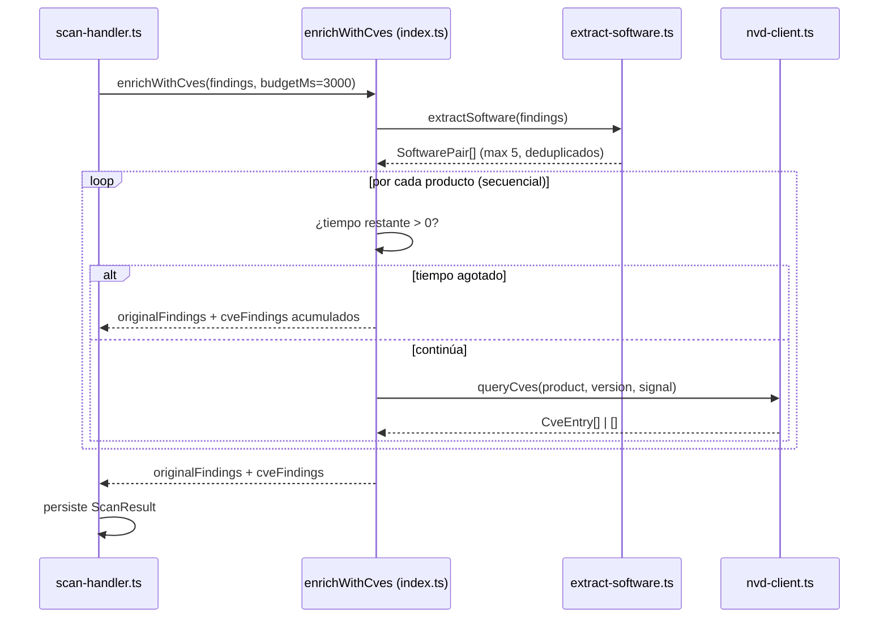

# Design Document — CVE Enricher

## Overview

Módulo post-escaneo que cruza software detectado (fingerprint/Nmap) contra la API pública del NVD para generar findings de vulnerabilidades conocidas. Se integra en `scan-handler.ts` entre la ejecución del orquestador y la persistencia en DynamoDB.

Principios de diseño:
- **Fail-open total**: ningún error del enriquecimiento interrumpe el flujo principal.
- **Presupuesto de tiempo estricto**: 3 000 ms máximo para toda la operación.
- **Sin dependencias nuevas**: solo `fetch` nativo con `AbortController`.
- **Sin API key**: máximo 5 productos por ejecución para respetar rate-limit público del NVD.

---

## Architecture



Flujo secuencial (no paralelo) para respetar rate-limit del NVD sin API key.

---

## Components and Interfaces

### `extract-software.ts`

```typescript
export interface SoftwarePair {
  product: string;  // nombre del software (normalizado a minúsculas)
  version: string;  // string de versión tal como se detectó
}

/**
 * Extrae pares producto+versión de los findings existentes.
 * Patrones soportados:
 *   1. Header-style: rawValue contiene "<header>: <product>/<version>"
 *   2. JSON-style: rawValue es JSON con campos { service, version }
 * Deduplica por (product lowercase, version exact).
 * Retorna máximo 5 pares.
 */
export function extractSoftware(findings: Finding[]): SoftwarePair[];
```

### `nvd-client.ts`

```typescript
export interface CveEntry {
  id: string;           // e.g. "CVE-2021-23017"
  cvssScore: number;    // 0.1–10.0
  description: string;  // primeros 500 chars (inglés)
}

/**
 * Consulta la API pública del NVD para un producto+versión.
 * - Endpoint: https://services.nvd.nist.gov/rest/json/cves/2.0?keywordSearch=<product> <version>
 * - Abort con signal proporcionado (AbortController externo).
 * - Retorna [] ante cualquier error (red, HTTP ≠2xx, JSON inválido).
 * - Extrae CVSS con precedencia: v3.1 → v3.0 → v2.0.
 * - Retorna top 3 por CVSS score descendente.
 * - No reintenta nunca.
 */
export function queryCves(
  product: string,
  version: string,
  signal: AbortSignal,
): Promise<CveEntry[]>;
```

### `index.ts` (orquestador del enricher)

```typescript
/**
 * Punto de entrada del CVE Enricher.
 * - Extrae software de findings.
 * - Consulta NVD secuencialmente con presupuesto de tiempo global.
 * - Mapea CveEntry → Finding con categoría 'known-vulnerabilities'.
 * - Fail-open: ante CUALQUIER excepción retorna originalFindings sin modificar.
 *
 * @returns findings originales + findings de CVE generados (o solo originales si falla).
 */
export async function enrichWithCves(
  findings: Finding[],
  budgetMs?: number,    // default 3000
): Promise<Finding[]>;
```

---

## Data Models

### CVSS → Severidad

| Rango CVSS     | FindingSeverity |
|----------------|-----------------|
| 9.0 – 10.0    | `critical`      |
| 7.0 – 8.9     | `high`          |
| 4.0 – 6.9     | `medium`        |
| 0.1 – 3.9     | `low`           |
| 0.0 / ausente | _(se omite)_    |

### Precedencia de versión CVSS

Se busca en el objeto `metrics` del CVE entry en este orden:
1. `cvssMetricV31[0].cvssData.baseScore`
2. `cvssMetricV30[0].cvssData.baseScore`
3. `cvssMetricV2[0].cvssData.baseScore`

Si ninguna existe o el score es 0.0, el CVE se descarta.

### Finding generado

```typescript
{
  category: 'known-vulnerabilities',
  severity: mapCvssToSeverity(entry.cvssScore),
  rawValue: `${entry.id} (CVSS ${entry.cvssScore})`,         // e.g. "CVE-2021-44228 (CVSS 10.0)"
  description: `${product} ${version}: ${entry.description}`, // truncado a 500 chars
}
```

### Gestión de tiempo (AbortController)

```
t0 = Date.now()                         // inicio de enrichWithCves
┌─ loop por cada producto (secuencial) ─┐
│  remaining = budgetMs - (Date.now() - t0)
│  if (remaining <= 0) → break, retorna lo acumulado
│  controller = new AbortController()
│  timeout = setTimeout(() => controller.abort(), remaining)
│  await queryCves(product, version, controller.signal)
│  clearTimeout(timeout)
└───────────────────────────────────────┘
```

Cada request individual también se aborta si se agota el presupuesto global restante. No existe un timeout fijo por request separado del global: el budget restante ES el timeout de cada request.

### Registro de categoría 'known-vulnerabilities'

4 puntos obligatorios:

1. **`types.ts`** — agregar `'known-vulnerabilities'` al union type `FindingCategory`.
2. **`validator.ts`** — agregar `'known-vulnerabilities'` al `VALID_CATEGORIES` Set.
3. **`fallback-generator.ts` (CATEGORY_DESCRIPTIONS)** — agregar entrada: `'known-vulnerabilities': 'vulnerabilidades conocidas (CVE) en software detectado'`.
4. **`fallback-generator.ts` (CATEGORY_RECOMMENDATIONS)** — agregar entrada: `'known-vulnerabilities': 'actualizar/parchear el software a una versión que corrija la vulnerabilidad; revisar el aviso del CVE'`.

---

## Error Handling

| Punto de fallo | Comportamiento |
|---|---|
| `extractSoftware` lanza excepción | `enrichWithCves` captura → retorna `findings` original |
| NVD HTTP 429/403/5xx | `queryCves` retorna `[]`, log del status, continúa siguiente producto |
| NVD timeout (signal aborted) | `queryCves` retorna `[]`, log timeout, continúa |
| NVD JSON inválido / sin `vulnerabilities` | `queryCves` retorna `[]`, log parse error |
| Budget global agotado mid-loop | break del loop, retorna findings + CVEs parciales ya recolectados |
| Excepción no controlada en `enrichWithCves` | try/catch global → log → retorna `findings` original |
| `enrichWithCves` rechaza su Promise | `scan-handler` captura → persiste sin CVEs |

Regla: **nunca se lanza una excepción al caller**. Todo error se traduce en `[]` (por producto) o findings originales sin modificar (global).

---

## Testing Strategy

**Framework**: Vitest (ya existente en el proyecto).
**Enfoque**: unit tests con mock de `globalThis.fetch`. Sin llamadas de red reales. Sin property-based testing.

### Tests de `extract-software.ts`

- Header-style: `"Server: nginx/1.18.0"` → `{ product: "nginx", version: "1.18.0" }`.
- JSON-style: `'{"service":"OpenSSH","version":"8.2p1"}'` → extrae par.
- rawValue null/vacío/sin patrón → excluido.
- Deduplicación case-insensitive en product.
- Lista vacía de findings → lista vacía sin error.
- Más de 5 productos → retorna solo los primeros 5.

### Tests de `nvd-client.ts`

- Respuesta exitosa: parsea CVEs, aplica precedencia CVSS (v3.1 > v3.0 > v2.0), top 3.
- HTTP 429 → retorna `[]`.
- HTTP 500 → retorna `[]`.
- Timeout (AbortError) → retorna `[]`.
- JSON inválido → retorna `[]`.
- CVE sin score CVSS → se omite.

### Tests de `index.ts` (`enrichWithCves`)

- Happy path: 2 productos, NVD responde → findings originales + CVE findings.
- Budget agotado: mock de `Date.now` para simular timeout global → retorna parcial.
- NVD falla en todos los productos → retorna solo findings originales.
- **Test fail-open crítico**: NVD retorna 429 en todos los requests Y un producto hace timeout → `enrichWithCves` retorna exactamente los findings originales sin lanzar excepción.
- Excepción inesperada en extractSoftware (mock que lanza) → retorna findings originales.

### Test de integración en `scan-handler`

- `enrichWithCves` rechaza su Promise → handler persiste ScanResult con findings originales sin CVE enrichment.

### Configuración de mocks

```typescript
// Patrón: mockear fetch global
const mockFetch = vi.fn();
globalThis.fetch = mockFetch;

// Ejemplo: simular timeout
mockFetch.mockImplementation(() => {
  return new Promise((_, reject) => {
    setTimeout(() => reject(new DOMException('Aborted', 'AbortError')), 50);
  });
});
```
