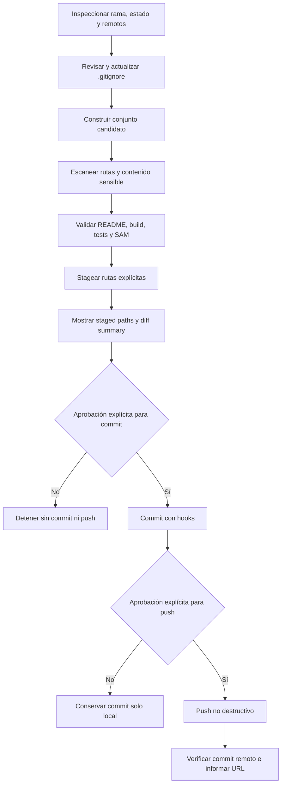

# Design Document: Publicación segura en GitHub

## Overview

El `Preparador_de_Publicación` será un flujo secuencial y fail-closed para preparar CentinelaIA sin publicar contenido sensible ni alterar historial. El flujo separa inspección, corrección local, validación, staging explícito, aprobación, commit y push. Ninguna etapa posterior continúa si falla una comprobación crítica.

Hallazgos de investigación: Git admite staging por rutas explícitas, ejecuta hooks durante el commit salvo que se omitan deliberadamente y rechaza por defecto actualizaciones no fast-forward. AWS SAM CLI ofrece `sam validate` para comprobar `infra/template.yaml`. Referencias: [git-add](https://git-scm.com/docs/git-add), [githooks](https://git-scm.com/docs/githooks), [git-push](https://www.git-scm.com/docs/git-push), [sam validate](https://docs.aws.amazon.com/serverless-application-model/latest/developerguide/sam-cli-command-reference-sam-validate.html). Contenido reformulado para cumplir restricciones de licencia.

## Architecture



Cada transición genera un resultado `passed`, `blocked` o `pending`. Solo AWS SAM puede quedar `pending`, exclusivamente cuando la CLI no está disponible.

## Components and Interfaces

### 1. Repository Inspector

- Obtiene rama y estado staged/unstaged/untracked mediante operaciones de solo lectura equivalentes a `git status --short --branch`.
- Enumera nombre y URL de cada remoto y deriva `owner/repository` para revisión humana.
- Bloquea el push si un remoto confirmado no coincide con el destino aprobado; no cambia remotos automáticamente.
- Si no hay remoto, permite llegar al intento de push, deja que Git falle de forma segura y reporta cómo configurar el destino; no inventa una URL.

### 2. Ignore Policy Reviewer

- Compara `.gitignore` con las categorías exigidas: dependencias, cualquier `dist/build`, SAM local, entornos, AWS local, claves, cobertura, caché y logs.
- Propone y aplica únicamente reglas faltantes durante preparación.
- Construye el conjunto candidato desde archivos no ignorados y verifica archivos rastreados que ahora coincidan con exclusiones.
- Un archivo excluido pero rastreado bloquea el flujo hasta retirarlo del índice mediante una acción explícita y aprobada que conserve el archivo local.
### 3. Sensitive Content Scanner

- Escanea dos universos independientes: archivos rastreados y Conjunto_de_Publicación.
- Detecta por nombre/ruta (`.env*`, `.aws/`, credenciales, `*.pem`, `*.key`, `*.p12`, `*.pfx`) y por contenido (access keys AWS `AKIA`/`ASIA`, secret access keys, tokens, contraseñas, encabezados de clave privada y credenciales embebidas).
- Excluye `.env.example` solo si contiene nombres y valores ficticios no autenticables.
- Reporta únicamente ruta, categoría y estado; redacta el valor y cualquier fragmento sensible.
- Cualquier hallazgo, error de lectura, archivo omitido o scanner incompleto bloquea commit y push.

### 4. Validation Gate

Ejecuta en orden y conserva salida resumida y código de resultado:

1. `README.md` raíz: debe existir y cubrir propósito, preparación local, `npm run build`, `npm test` y despliegue AWS SAM, sin secretos.
2. Build: ejecuta exactamente `npm run build` cuando las dependencias están disponibles.
3. Tests: tras build exitoso ejecuta `npm test`; el script actual usa `vitest run`, no watch.
4. SAM: si existe la CLI, ejecuta la validación de `infra/template.yaml`; una plantilla inválida bloquea. Si la CLI no existe, registra `pending` y permite continuar si no falló otra puerta.

### 5. Explicit Stager and Approval Gate

- Recibe una lista cerrada de rutas aprobadas; usa staging equivalente a `git add -- <path>...` y prohíbe `git add .`, `git add -A` y staging implícito por commit.
- Tras staging vuelve a escanear el contenido indexado y presenta rutas staged, resumen de cambios y diff redactado cuando corresponda.
- Solicita aprobación explícita para crear el commit. Rechazo o ausencia de respuesta detiene el flujo conservando el índice para revisión.
- Después del commit solicita aprobación explícita separada para publicar; la aprobación del commit no se interpreta como aprobación del push.

### 6. Safe Committer and Publisher

- Crea un commit nuevo y descriptivo sin `--amend` ni `--no-verify`; cualquier fallo de hooks bloquea el push.
- Antes del push actualiza conocimiento del remoto sin modificar ramas de trabajo y comprueba que el cambio sea fast-forward.
- Ejecuta un push normal de la rama local al remoto aprobado, con `-u` solo para una rama nueva.
- Prohíbe `--force`, `--force-with-lease`, rebase automático, reset destructivo, limpieza, borrado de ramas y omisión de hooks.
- Ante divergencia o rechazo non-fast-forward, conserva ambos historiales y deriva la resolución al usuario.
- Verifica que el SHA del commit sea alcanzable desde la referencia remota y reporta SHA y URL pública.

## Data Models

```text
PublicationPlan {
  branch, approvedRemote?, destinationRepository?, candidatePaths[],
  trackedPaths[], stagedPaths[], commitMessage
}
CheckResult { name, status: passed|blocked|pending, safeDetails[] }
SensitiveFinding { path, category }               // nunca incluye el valor
Approval { scope: commit|push, approved, timestamp }
PublicationResult { localCommitSha?, remoteCommitSha?, publicUrl? }
```

El `PublicationPlan` es inmutable entre la aprobación del commit y su creación. Si cambia el índice, el conjunto candidato o el HEAD, se invalidan las aprobaciones y se repiten escaneo, validación y revisión.

## Error Handling

- **Secretos o análisis incompleto:** bloquear commit/push, redactar valores y permitir solo correcciones locales.
- **Exclusión faltante o archivo excluido rastreado:** bloquear y listar rutas/reglas necesarias.
- **README, build o tests fallidos:** bloquear y mostrar comando, código de salida y resumen no sensible.
- **SAM ausente:** marcar `pending`; **SAM presente con plantilla inválida:** bloquear.
- **Remoto incorrecto:** bloquear push. **Remoto ausente:** permitir el intento seguro y reportar el fallo sin crear/modificar remotos.
- **Hooks fallidos, índice cambiado o aprobación ausente:** detener antes de la siguiente operación irreversible.
- **Push rechazado o divergente:** no forzar ni reescribir; conservar estado para resolución manual.

## Testing Strategy

Property-based testing no aplica: el feature orquesta Git, GitHub, filesystem, npm y AWS SAM con efectos externos, sin una transformación pura con espacio amplio de entradas. Se usarán pruebas automatizadas de ejemplo e integración controlada:

- Fixtures temporales para reglas faltantes, archivos ignorados rastreados, `.env.example` válido y nombres sensibles.
- Casos redactados para cada categoría de secreto, errores de lectura y análisis incompleto.
- Repositorios Git temporales con estados staged/unstaged/untracked, hooks exitosos/fallidos, remoto ausente/incorrecto y rechazo non-fast-forward.
- Dobles de proceso para comprobar orden build → tests → SAM y la semántica `blocked/pending`.
- Verificación de que ningún comando generado contiene opciones destructivas, staging global o bypass de hooks.
- Prueba de invalidación de aprobación cuando cambian HEAD o el índice.

La ejecución real de publicación permanece fuera de las pruebas y requiere las dos aprobaciones explícitas.