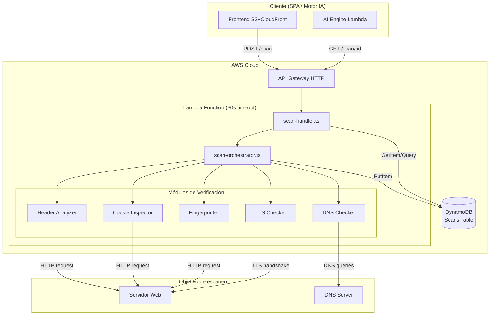
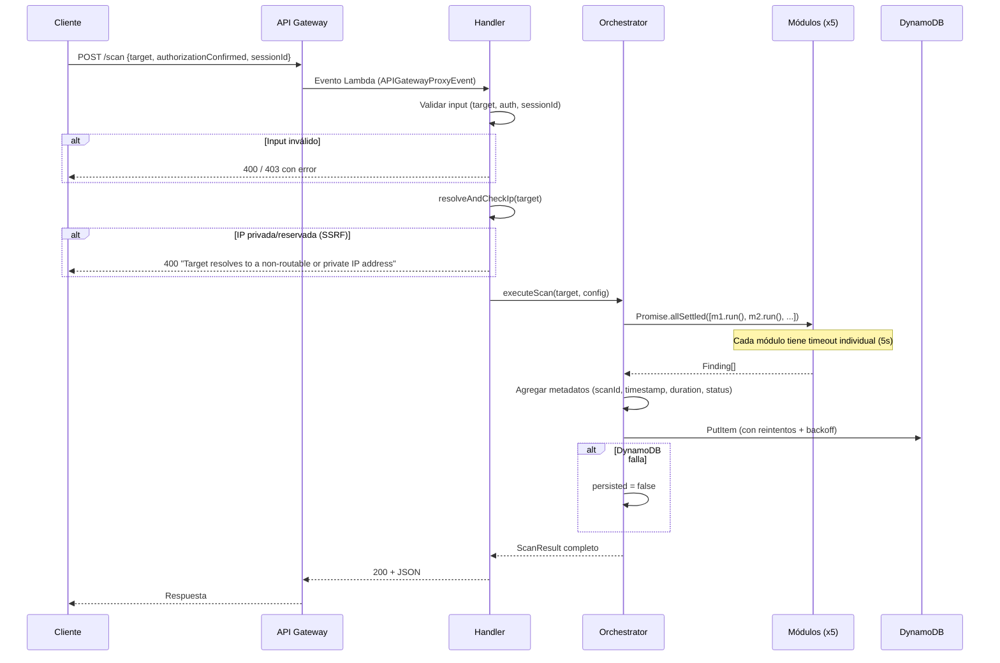

# Design Document — Scanner Module (CentinelaIA)

## Overview

El módulo Scanner es el componente central de escaneo técnico de CentinelaIA. Recibe una URL o dominio, ejecuta verificaciones de seguridad en paralelo mediante módulos independientes, y retorna hallazgos estructurados en JSON.

### Decisiones clave de diseño

| Decisión | Elección | Por qué |
|----------|----------|---------|
| Ejecución síncrona | Respuesta en la misma request HTTP | Simplifica el MVP: no necesitamos polling, websockets ni SQS. Lambda tiene 30s de timeout, suficiente para nuestros 5 módulos. |
| Módulos independientes con interfaz común | Patrón Strategy/Plugin | Permite agregar módulos nuevos (ej. port scanning) sin tocar código existente. Cada módulo se prueba aislado. |
| Node.js `tls` y `dns/promises` nativos | Cero dependencias externas para red | Reduce tamaño del bundle Lambda, evita vulnerabilidades de supply chain, y Node 20 ya incluye todo lo necesario. |
| DynamoDB on-demand | Pago por uso, $0 en reposo | Encaja en free tier para el volumen del hackathon (~pocas decenas de escaneos). |
| AWS SAM (template.yaml) | IaC declarativo simple | Más rápido que CDK para un proyecto de 5 días, sin compilar la infra. |
| Validación anti-SSRF pre-escaneo | Resolver IP del target y bloquear rangos privados/reservados | La Lambda tiene un rol IAM; sin esta validación, un atacante podría usar el scanner como proxy para acceder al endpoint de metadata de AWS (169.254.169.254) y filtrar credenciales. |
| Throttling en API Gateway | Rate limit 5 req/s, burst 10 | El API queda público sin auth para el MVP; sin throttling, cualquiera puede generar costos repitiendo POST /scan. |

---

## Architecture

### Diagrama de alto nivel



### Flujo de una solicitud POST /scan



### Por qué esta arquitectura funciona para un hackathon de 5 días

1. **Una sola Lambda** — No necesitamos Step Functions ni múltiples Lambdas porque el escaneo toma <25 segundos.
2. **Ejecución paralela con `Promise.allSettled`** — Si un módulo falla o hace timeout, los demás siguen. Obtenemos resultados parciales en vez de falla total.
3. **Handler delgado** — El handler solo parsea el evento HTTP y llama al orquestador. La lógica de negocio vive en `services/`. Esto hace que los tests no necesiten simular API Gateway.
4. **Sin colas ni async** — El frontend espera la respuesta. Para ~5 módulos con timeout de 5s cada uno ejecutándose en paralelo, el total es <10s en el peor caso.

---

## Components and Interfaces

### Estructura de archivos

```
backend/
├── handlers/
│   └── scan-handler.ts          # Handler Lambda: parsea evento, valida, delega
├── services/
│   └── scanner/
│       ├── index.ts             # Re-export público del módulo scanner
│       ├── orchestrator.ts      # Orquesta módulos, maneja timeouts, genera ScanResult
│       ├── validator.ts         # Valida target, authorization, sessionId
│       ├── modules/
│       │   ├── types.ts         # Interfaz común ScanModule + tipos Finding
│       │   ├── header-analyzer.ts
│       │   ├── tls-checker.ts
│       │   ├── cookie-inspector.ts
│       │   ├── dns-checker.ts
│       │   └── fingerprinter.ts
│       └── store.ts             # Persistencia DynamoDB (put, get, query)
├── models/
│   └── scan.ts                  # Tipos/interfaces: Finding, ScanResult, ScanRequest
└── tests/
    └── scanner/
        ├── header-analyzer.test.ts
        ├── tls-checker.test.ts
        ├── cookie-inspector.test.ts
        ├── dns-checker.test.ts
        ├── fingerprinter.test.ts
        ├── orchestrator.test.ts
        ├── validator.test.ts
        └── store.test.ts
```

### Interfaz común de módulos (Low-Level Design)

```typescript
// backend/services/scanner/modules/types.ts

/**
 * Categorías válidas de hallazgos — una por módulo de verificación.
 */
export type FindingCategory =
  | 'http-headers'
  | 'tls-ssl'
  | 'cookies'
  | 'dns-security'
  | 'server-fingerprint';

/**
 * Niveles de severidad ordenados de mayor a menor impacto.
 */
export type FindingSeverity = 'critical' | 'high' | 'medium' | 'low' | 'info';

/**
 * Un hallazgo individual de seguridad.
 * Esta estructura es el "contrato" entre el scanner y el motor de IA (Spec 2).
 */
export interface Finding {
  category: FindingCategory;
  severity: FindingSeverity;
  rawValue: string | null;
  description: string; // 10-500 caracteres
}

/**
 * Configuración que recibe cada módulo de verificación.
 */
export interface ScanModuleInput {
  /** URL completa (con esquema) para verificaciones HTTP */
  targetUrl: string;
  /** Dominio extraído (sin esquema ni path) para verificaciones DNS/TLS */
  targetDomain: string | null;
  /** Si el target es una IP en vez de dominio */
  isIpAddress: boolean;
  /** Timeout en milisegundos para este módulo */
  timeoutMs: number;
}

/**
 * Interfaz que TODO módulo de verificación debe implementar.
 * 
 * ¿Por qué una interfaz común?
 * → Permite al orquestador tratar todos los módulos de forma uniforme.
 * → Agregar un módulo nuevo = implementar esta interfaz + registrarlo.
 * → Cada módulo se puede probar de forma aislada pasándole un ScanModuleInput.
 */
export interface ScanModule {
  /** Nombre identificador del módulo (para logs y errores) */
  readonly name: string;
  /** Categoría de findings que produce este módulo */
  readonly category: FindingCategory;
  /** Ejecuta la verificación y retorna hallazgos */
  run(input: ScanModuleInput): Promise<Finding[]>;
}
```

### Handler Lambda

```typescript
// backend/handlers/scan-handler.ts (firma)

import { APIGatewayProxyEvent, APIGatewayProxyResult } from 'aws-lambda';

/**
 * Handler único para todas las rutas del scanner.
 * API Gateway enruta según method+path; el handler delega:
 * - POST /scan → ejecutar escaneo
 * - GET /scan/{scanId} → consultar resultado por ID
 * - GET /scan?sessionId=X → listar escaneos de sesión
 */
export async function handler(
  event: APIGatewayProxyEvent
): Promise<APIGatewayProxyResult>;
```

### Orquestador

```typescript
// backend/services/scanner/orchestrator.ts (firma)

import { ScanModule, ScanModuleInput } from './modules/types';
import { ScanResult } from '../../models/scan';

export interface OrchestratorConfig {
  /** Timeout por módulo en ms (default: 5000, rango: 1000-10000) */
  moduleTimeoutMs: number;
  /** Timeout global en ms (default: 25000) */
  globalTimeoutMs: number;
  /** Módulos registrados para ejecutar */
  modules: ScanModule[];
}

/**
 * Ejecuta todos los módulos de verificación en paralelo,
 * maneja timeouts individuales y globales,
 * y genera el ScanResult final.
 */
export async function executeScan(
  input: ScanModuleInput,
  config: OrchestratorConfig
): Promise<ScanResult>;
```

### Validador

```typescript
// backend/services/scanner/validator.ts (firma)

export interface ValidationResult {
  valid: boolean;
  error?: { code: number; message: string };
  /** Si es válido, contiene los datos normalizados */
  normalized?: {
    targetUrl: string;
    targetDomain: string | null;
    isIpAddress: boolean;
  };
}

export interface ScanRequestBody {
  target: string;
  authorizationConfirmed: boolean;
  sessionId: string;
}

/**
 * Valida y normaliza el request completo.
 * Orden: 1) campos requeridos, 2) authorization, 3) target format, 4) SSRF check
 */
export function validateScanRequest(body: unknown): Promise<ValidationResult>;

/**
 * Valida y normaliza solo el target (URL, dominio, o IP).
 * Extrae dominio, determina si es IP, aplica HTTPS por defecto.
 */
export function validateTarget(target: string): ValidationResult;

/**
 * Resuelve el dominio a IP(s) y verifica que ninguna pertenezca a rangos
 * privados, loopback, link-local o reservados (prevención de SSRF).
 * Se ejecuta una sola vez después de validateTarget(), antes de invocar
 * al orquestador.
 * 
 * IMPORTANTE: Esta función se exporta como standalone reutilizable para que
 * los módulos que siguen redirecciones (Header Analyzer, Cookie Inspector,
 * Fingerprinter) puedan invocarla en cada salto de redirección, validando
 * la IP de destino del header Location antes de conectar.
 * 
 * Rangos bloqueados:
 * - IPv4: 10.0.0.0/8, 172.16.0.0/12, 192.168.0.0/16, 127.0.0.0/8, 169.254.0.0/16
 * - IPv6: ::1, fe80::/10, fc00::/7
 * 
 * Si el dominio resuelve a múltiples IPs (round-robin), TODAS se validan.
 * Si alguna cae en rango prohibido, se rechaza la solicitud completa.
 */
export async function resolveAndCheckIp(
  targetDomain: string | null,
  targetIp: string | null
): Promise<{ allowed: boolean; resolvedIp?: string; error?: string }>;
```

### Store (Persistencia)

```typescript
// backend/services/scanner/store.ts (firma)

import { ScanResult } from '../../models/scan';

export interface ScanStore {
  /** Guarda un ScanResult. Reintenta hasta 2 veces con backoff exponencial. */
  put(result: ScanResult): Promise<{ persisted: boolean }>;
  
  /** Recupera un ScanResult por scanId. */
  get(scanId: string): Promise<ScanResult | null>;
  
  /** Lista ScanResults por sessionId, ordenados por timestamp desc, max 50. */
  listBySession(sessionId: string): Promise<ScanResult[]>;
}

/**
 * Implementación con DynamoDB DocumentClient.
 * Maneja truncamiento si el item excede 390KB.
 */
export function createDynamoStore(tableName: string): ScanStore;
```

### Firmas de cada módulo de verificación

```typescript
// Cada módulo exporta una función factory que retorna un ScanModule:

// header-analyzer.ts
export function createHeaderAnalyzer(): ScanModule;

// tls-checker.ts
export function createTlsChecker(): ScanModule;

// cookie-inspector.ts
export function createCookieInspector(): ScanModule;

// dns-checker.ts
export function createDnsChecker(): ScanModule;

// fingerprinter.ts
export function createFingerprinter(): ScanModule;
```

### Detalle interno: Header Analyzer

```typescript
// Lógica interna (no expuesta, para referencia de implementación)

const SECURITY_HEADERS_CONFIG = {
  'Strict-Transport-Security': { absent: 'high', insecure: 'medium' },
  'Content-Security-Policy':   { absent: 'high', insecure: 'medium' },
  'X-Frame-Options':           { absent: 'medium', insecure: 'medium' },
  'X-Content-Type-Options':    { absent: 'medium', insecure: 'medium' },
  'Permissions-Policy':        { absent: 'medium', insecure: 'medium' },
  'Referrer-Policy':           { absent: 'low', insecure: 'medium' },
  'X-XSS-Protection':          { absent: 'low', insecure: 'medium' },
} as const;

// El módulo hace un GET al targetUrl con redirect DESHABILITADO (redirect: 'manual').
// Si recibe una respuesta 3xx con header Location:
//   1. Extrae el host/IP de la URL del Location
//   2. Llama a resolveAndCheckIp() para validar que no sea IP privada/reservada
//   3. Si la IP es válida, sigue la redirección manualmente
//   4. Si la IP es prohibida, aborta el seguimiento y genera un Finding:
//      { category: 'http-headers', severity: 'medium', description: 'Redirect blocked: SSRF protection' }
// Luego lee los response headers de la respuesta final y genera Findings según la config.
```

### Detalle interno: TLS Checker

```typescript
// Usa Node.js built-in `tls.connect()` con opciones específicas:
// - Para cada versión de protocolo: intenta conexión con minVersion=maxVersion=X
// - Node 20 no soporta conectar con SSLv2/SSLv3 (deshabilitados en OpenSSL);
//   se reporta como "no verificable desde este cliente" con severidad "info".
// - Para cipher suites: analiza socket.getCipher() y socket.getPeerCertificate()
// - Para certificado: socket.getPeerCertificate(true) obtiene la cadena completa

// Limitación conocida: Node.js no puede forzar conexión con SSLv2/SSLv3 porque
// OpenSSL los deshabilitó. El módulo intentará TLS 1.0-1.3 y reportará 
// SSLv2/SSLv3 como "no testable directamente" con una nota informativa.
```

### Detalle interno: DNS Checker

```typescript
// Usa Node.js built-in `dns.promises.resolveTxt()`:
// - SPF: resolveTxt(domain) → buscar registro que empiece con "v=spf1"
// - DMARC: resolveTxt(`_dmarc.${domain}`) → buscar "v=DMARC1"
// - DKIM: resolveTxt(`${selector}._domainkey.${domain}`) para cada selector
//   en ['default', 'google', 'selector1', 'selector2']
// Timeout: usa AbortController con signal para cancelar tras 5s
```

### Detalle interno: Cookie Inspector

```typescript
// El módulo hace un GET al targetUrl con redirect DESHABILITADO (redirect: 'manual').
// Sigue redirecciones manualmente hasta un máximo de 5 saltos:
//   1. Recibe respuesta 3xx con header Location
//   2. Extrae el host/IP de la URL del Location
//   3. Llama a resolveAndCheckIp() para validar que no sea IP privada/reservada
//   4. Si la IP es válida, sigue la redirección y acumula cookies (Set-Cookie)
//   5. Si la IP es prohibida, aborta la cadena de redirecciones y genera un Finding:
//      { category: 'cookies', severity: 'medium', description: 'Redirect blocked: SSRF protection' }
//      Luego analiza las cookies recolectadas hasta ese punto.
// Parsea headers Set-Cookie de todas las respuestas acumuladas (max 50 cookies).
// Verifica flags: Secure, HttpOnly, SameSite por cada cookie.
```

### Detalle interno: Fingerprinter

```typescript
// El módulo hace un GET al targetUrl con redirect DESHABILITADO (redirect: 'manual').
// Si recibe una respuesta 3xx con header Location:
//   1. Extrae el host/IP de la URL del Location
//   2. Llama a resolveAndCheckIp() para validar que no sea IP privada/reservada
//   3. Si la IP es válida, sigue la redirección manualmente
//   4. Si la IP es prohibida, aborta el seguimiento y genera un Finding:
//      { category: 'server-fingerprint', severity: 'medium', description: 'Redirect blocked: SSRF protection' }
// Luego examina los headers de la respuesta final:
//   Server, X-Powered-By, X-AspNet-Version, X-Generator
// Genera Finding severity "low" por cada header con valor presente.
// Genera Finding severity "info" si ningún header divulga tecnología.
```

---

## Data Models

### ScanResult (modelo principal)

```typescript
// backend/models/scan.ts

import { Finding, FindingCategory, FindingSeverity } from '../services/scanner/modules/types';

export type ScanStatus = 'complete' | 'partial' | 'unreachable' | 'error';

/**
 * Resultado completo de un escaneo. Este es el objeto que se persiste
 * en DynamoDB y se retorna al cliente via API.
 */
export interface ScanResult {
  /** UUID v4 único del escaneo */
  scanId: string;
  /** URL o dominio original proporcionado por el usuario */
  target: string;
  /** ISO 8601 timestamp de inicio del escaneo */
  timestamp: string;
  /** Duración total en milisegundos */
  durationMs: number;
  /** Cantidad total de findings (debe = findings.length) */
  totalFindings: number;
  /** Estado final del escaneo */
  status: ScanStatus;
  /** Identificador de sesión para agrupar escaneos */
  sessionId: string;
  /** Evidencia de consentimiento de autorización */
  consent: ConsentEvidence;
  /** Array de hallazgos individuales */
  findings: Finding[];
  /** Si el resultado fue persistido en DynamoDB */
  persisted: boolean;
  /** Si el resultado fue truncado para caber en DynamoDB (400KB limit) */
  truncated?: boolean;
}

export interface ConsentEvidence {
  authorizationConfirmed: boolean;
  target: string;
  confirmedAt: string; // ISO 8601
}
```

### DynamoDB Table Schema

```yaml
# En template.yaml (AWS SAM)
ScansTable:
  Type: AWS::DynamoDB::Table
  Properties:
    TableName: centinelaia-scans
    BillingMode: PAY_PER_REQUEST  # On-demand = free tier friendly
    AttributeDefinitions:
      - AttributeName: scanId
        AttributeType: S
      - AttributeName: sessionId
        AttributeType: S
      - AttributeName: timestamp
        AttributeType: S
    KeySchema:
      - AttributeName: scanId    # Partition key
        KeyType: HASH
    GlobalSecondaryIndexes:
      - IndexName: sessionId-timestamp-index
        KeySchema:
          - AttributeName: sessionId   # Partition key del GSI
            KeyType: HASH
          - AttributeName: timestamp   # Sort key (para ordenar desc)
            KeyType: RANGE
        Projection:
          ProjectionType: ALL
```

**¿Por qué esta estructura de DynamoDB?**
- **scanId como PK**: Permite recuperar un escaneo específico en O(1) con `GET /scan/{scanId}`.
- **GSI sessionId + timestamp**: Permite listar todos los escaneos de un usuario/sesión ordenados por fecha, que es el query pattern de `GET /scan?sessionId=X`.
- **PAY_PER_REQUEST**: No pagamos por capacidad ociosa. Para el volumen del hackathon (~10-50 escaneos), el costo es literalmente $0.

### Request/Response Schemas

```typescript
// POST /scan - Request body
interface PostScanRequest {
  target: string;                // URL, dominio, o IP
  authorizationConfirmed: boolean; // Debe ser true
  sessionId: string;             // UUID v4 o string no vacío
}

// POST /scan - Response (200)
// → ScanResult completo (ver interface arriba)

// GET /scan/{scanId} - Response (200)
// → ScanResult completo

// GET /scan/{scanId} - Response (404)
interface NotFoundResponse {
  error: string; // "Scan not found"
}

// GET /scan?sessionId=X - Response (200)
// → ScanResult[] (array, max 50, ordenado por timestamp desc)

// Error responses (400, 403, 500)
interface ErrorResponse {
  error: string; // Descripción del problema
}
```

### SAM Template (Infraestructura)

```yaml
# infra/template.yaml
AWSTemplateFormatVersion: '2010-09-09'
Transform: AWS::Serverless-2016-10-31
Description: CentinelaIA Scanner - Motor de escaneo de seguridad web

Globals:
  Function:
    Runtime: nodejs20.x
    Timeout: 30
    MemorySize: 256
    Environment:
      Variables:
        SCANS_TABLE: !Ref ScansTable
  HttpApi:
    Auth:
      DefaultAuthorizer: NONE

Resources:
  ScanFunction:
    Type: AWS::Serverless::Function
    Properties:
      Handler: dist/handlers/scan-handler.handler
      CodeUri: backend/
      Policies:
        - DynamoDBCrudPolicy:
            TableName: !Ref ScansTable
      Events:
        PostScan:
          Type: HttpApi
          Properties:
            Path: /scan
            Method: POST
            ApiId: !Ref ScanHttpApi
        GetScanById:
          Type: HttpApi
          Properties:
            Path: /scan/{scanId}
            Method: GET
            ApiId: !Ref ScanHttpApi
        GetScansBySession:
          Type: HttpApi
          Properties:
            Path: /scan
            Method: GET
            ApiId: !Ref ScanHttpApi

  ScanHttpApi:
    Type: AWS::Serverless::HttpApi
    Properties:
      StageName: prod
      # Throttling: protege contra abuso en un API público sin autenticación.
      # Rate limit de 5 req/s y burst de 10 mantiene costos controlados
      # durante el hackathon sin afectar demos normales.
      RouteSettings:
        "POST /scan":
          ThrottlingBurstLimit: 10
          ThrottlingRateLimit: 5

  ScansTable:
    Type: AWS::DynamoDB::Table
    Properties:
      TableName: centinelaia-scans
      BillingMode: PAY_PER_REQUEST
      AttributeDefinitions:
        - AttributeName: scanId
          AttributeType: S
        - AttributeName: sessionId
          AttributeType: S
        - AttributeName: timestamp
          AttributeType: S
      KeySchema:
        - AttributeName: scanId
          KeyType: HASH
      GlobalSecondaryIndexes:
        - IndexName: sessionId-timestamp-index
          KeySchema:
            - AttributeName: sessionId
              KeyType: HASH
            - AttributeName: timestamp
              KeyType: RANGE
          Projection:
            ProjectionType: ALL

Outputs:
  ScanApiUrl:
    Description: URL del API de escaneo
    Value: !Sub "https://${ScanHttpApi}.execute-api.${AWS::Region}.amazonaws.com/prod"
```

---


## Correctness Properties

> **Nota MVP**: Las propiedades formales de correctitud y property-based testing con fast-check quedan como trabajo futuro post-hackathon. Para el MVP se implementan únicamente unit tests basados en ejemplos (ver Testing Strategy). Las propiedades documentadas aquí sirven como referencia conceptual para cuando se agregue PBT:

### Property 19: SSRF prevention

*For any* target that resolves to an IP address within private ranges (10.0.0.0/8, 172.16.0.0/12, 192.168.0.0/16), loopback (127.0.0.0/8, ::1), link-local (169.254.0.0/16, fe80::/10), or reserved ranges (fc00::/7), the validator SHALL reject with a 400 error without invoking the orchestrator.

**Validates: Requirements 2.1, 2.2, 2.3, 2.4**

---

## Error Handling

### Estrategia por capas

El manejo de errores sigue un modelo de "captura al nivel más cercano al problema":

```
┌─────────────────────────────────────────────────────────────┐
│ Handler (scan-handler.ts)                                    │
│  Captura: errores de parsing del evento, errores inesperados │
│  Responde: 400/500 con JSON {error: "..."}                   │
├─────────────────────────────────────────────────────────────┤
│ Orchestrator (orchestrator.ts)                               │
│  Captura: módulos que lanzan excepciones o exceden timeout   │
│  Acción: genera Finding de error, continúa con los demás     │
├─────────────────────────────────────────────────────────────┤
│ Módulos individuales                                         │
│  Captura: errores de red, parsing de respuestas malformadas  │
│  Acción: genera Finding describiendo el problema             │
├─────────────────────────────────────────────────────────────┤
│ Store (store.ts)                                             │
│  Captura: errores de DynamoDB                                │
│  Acción: reintenta 2 veces con backoff, luego retorna        │
│          persisted=false                                      │
└─────────────────────────────────────────────────────────────┘
```

### Errores de validación (400/403)

| Condición | Código | Mensaje |
|-----------|--------|---------|
| Body no es JSON válido | 400 | "Request body must be valid JSON" |
| Campo `target` faltante o vacío | 400 | "Field 'target' is required" |
| Target > 2048 chars | 400 | "Target exceeds maximum length of 2048 characters" |
| Esquema no soportado | 400 | "Only HTTP and HTTPS schemes are supported" |
| Formato inválido | 400 | "Target is not a valid URL, domain, or IP address" |
| Campo `sessionId` faltante | 400 | "Field 'sessionId' is required" |
| Target resuelve a IP privada/reservada | 400 | "Target resolves to a non-routable or private IP address" |
| `authorizationConfirmed` ≠ true | 403 | "Authorization confirmation is required" |

### Errores de módulo (no interrumpen el escaneo)

```typescript
// Si un módulo falla, el orquestador genera:
{
  category: modulo.category,  // ej. 'tls-ssl'
  severity: 'info',           // 'low' para timeouts
  rawValue: error.message,
  description: `Module ${modulo.name} failed: ${error.message}` // ≥10 chars
}
```

### Redirección bloqueada por SSRF (no interrumpe el escaneo)

| Condición | Severidad | Categoría | Acción |
|-----------|-----------|-----------|--------|
| Redirección (3xx Location) apunta a IP privada/reservada | medium | La del módulo que la detecta (http-headers o cookies) | Abortar el seguimiento de esa redirección, generar Finding, continuar el escaneo con los datos obtenidos hasta ese salto |

### Errores de persistencia (no interrumpen la respuesta)

Si DynamoDB falla tras 2 reintentos:
- El ScanResult se retorna al cliente normalmente.
- Se agrega `persisted: false` al response.
- Se loguea el error con `console.error` (CloudWatch lo captura).
- El usuario puede reintentar el escaneo completo; los resultados no se pierden porque van en la respuesta HTTP.

### Timeout global (25s safety margin)

```typescript
// Pseudocódigo del mecanismo de timeout global
const globalTimer = setTimeout(() => {
  abortController.abort(); // Cancela módulos pendientes
}, 25_000);

// Cuando se dispara:
// 1. Se marcan los módulos no completados como "cancelled"
// 2. Se genera un Finding por cada módulo cancelado
// 3. Se retorna ScanResult con status "partial"
```

### Reintentos (solo para DynamoDB)

```typescript
// Backoff exponencial: 100ms → 400ms (base * 2^attempt)
const RETRY_CONFIG = {
  maxRetries: 2,
  baseDelayMs: 100,
  backoffMultiplier: 2,
};
```

**¿Por qué no reintentamos las conexiones HTTP a los targets?**
Porque estamos midiendo la seguridad del target *tal como se presenta*. Si no responde, eso es un hallazgo en sí mismo ("unreachable"). Reintentar enmascararía problemas reales de disponibilidad. Además, con 5 módulos ejecutándose en paralelo y timeout global de 25s, no hay presupuesto de tiempo para reintentos.

---

## Testing Strategy

### Herramientas

| Herramienta | Propósito | Por qué esta |
|-------------|-----------|-------------|
| **Vitest** | Test runner + assertions | Rápido, nativo ESM, TypeScript sin config extra. Es el estándar para proyectos Node.js modernos. |

### Estructura de tests

```
backend/tests/scanner/
├── validator.test.ts              # Validación de input + SSRF check
├── header-analyzer.test.ts        # Unit tests Req 14.1 (3 tests mínimo)
├── tls-checker.test.ts            # Unit tests Req 14.2 (3 tests mínimo)
├── cookie-inspector.test.ts       # Unit tests Req 14.3 (2 tests mínimo)
├── dns-checker.test.ts            # Unit tests Req 14.4 (3 tests mínimo)
├── fingerprinter.test.ts          # Unit tests Req 14.5 (2 tests mínimo)
├── orchestrator.test.ts           # Timeout handling, status determination
└── store.test.ts                  # DynamoDB put/get/query con mocks
```

### Enfoque: Unit tests con fixtures

- Verifican comportamiento con datos concretos y conocidos (ejemplo-based).
- Cubren los requisitos mínimos de testing del Requisito 14.
- Usan mocks/fixtures para aislar de la red — **no se hacen conexiones reales**.
- Útiles para edge cases específicos (cookie malformada, certificado expirado, IP privada).
- Sin metas de cobertura por porcentaje — el objetivo es cubrir los casos representativos definidos en cada criterio de aceptación.

### Configuración

```typescript
// vitest.config.ts
import { defineConfig } from 'vitest/config';

export default defineConfig({
  test: {
    globals: true,
    environment: 'node',
  },
});
```

### Mocks para tests de módulos

Todos los módulos de verificación hacen llamadas de red. En tests:
- **No se hacen conexiones reales** (Requisito 14.6).
- Se mockean las funciones de bajo nivel (`tls.connect`, `dns.promises.resolveTxt`, `fetch`/`http.get`).
- Los mocks retornan datos que simulan respuestas reales de servidores.

```typescript
// Ejemplo: mock de respuesta HTTP para Header Analyzer
vi.mock('node:http', () => ({
  get: vi.fn((url, cb) => {
    const mockResponse = {
      headers: {
        'strict-transport-security': 'max-age=31536000',
        'x-content-type-options': 'nosniff',
        // Sin CSP → debe generar Finding "high"
      },
    };
    cb(mockResponse);
  }),
}));
```

### Tests de integración (opcional, no bloqueante para MVP)

Si hay tiempo disponible al final del sprint:
- `handler.integration.test.ts` — Verificar endpoints API completos con evento simulado de API Gateway.
- `dynamo.integration.test.ts` — Verificar read/write a DynamoDB local con `@aws-sdk/client-dynamodb`.

Estos no son requisito para dar por completado el spec; se implementan solo si sobra tiempo.

---
